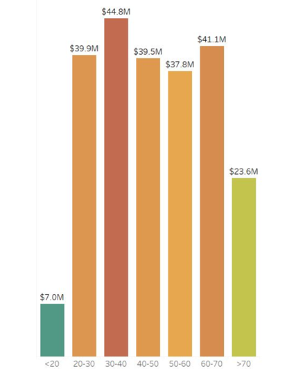
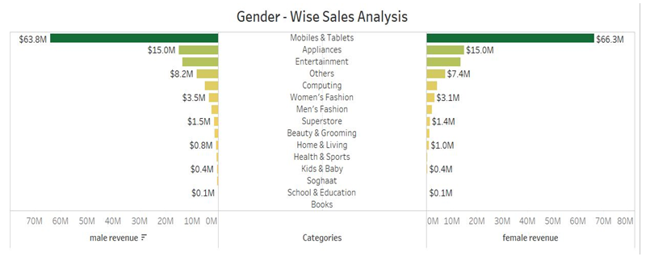
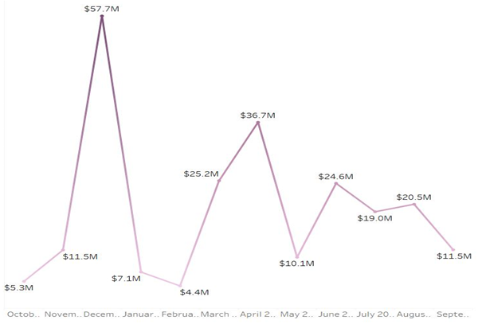
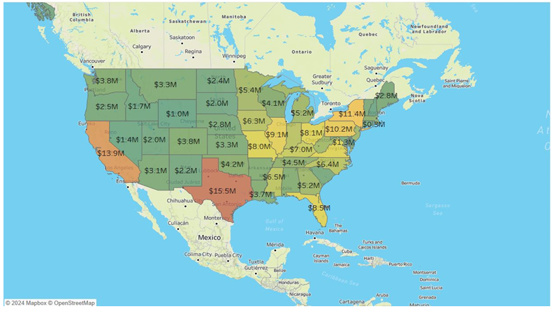
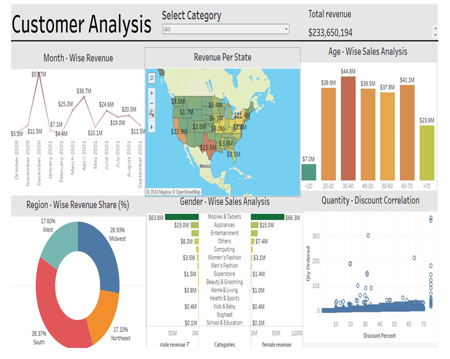

# Customer Behavior Analysis for E-Commerce Data using Tableau (2024)

This project presents a detailed analysis of customer behavior for e-commerce data leveraging **Tableau** for interactive data visualizations. By examining browsing patterns, purchasing decisions, product reviews, and interface engagement, we derive actionable insights to inform business strategies.

## 📊 Project Objectives

- Analyze customer browsing patterns, purchase decisions, and product review sentiment.
- Understand how different factors (like product ratings, pricing, and discounts) influence customer behavior.
- Visualize engagement metrics to enhance user interface design and customer experience.
- Identify key customer segments for targeted marketing and personalization strategies.

## 🛠️ Tools and Technologies

- **Tableau Desktop/Public**: For creating interactive dashboards and visual analytics.
- **Microsoft Excel**: For preliminary data cleaning and organization.

## 🗂️ Dataset Overview

The dataset includes the following columns:

- `order_id`, `order_date`, `item_id`, `sku`, `qty_ordered`, `price`, `value`, `discount_total`
- `category`, `payment_type`, `cost_id`, `year`, `month`, `ref_num`
- `Name Prefix`, `First Name`, `Middle Initial`, `Last Name`, `Gender`, `Age`
- `full_name`, `Email`, `Customer Since`, `SSN`, `Phone No.`
- `Place Name`, `County`, `City`, `State`, `Zip`, `Region`, `User Name`, `Discount_Percent`

> **Note**: Sensitive information like SSN and Phone Numbers are anonymized.

## 🔥 Key Insights and Visualizations

- **Total Revenue**:  
  - Overall revenue: **$233.65 million**.

- **Age-Wise Sales Analysis**:  
  - Highest revenue comes from the **30-40 age group** ($44.8 million), followed by the **60-70 age group** ($41.1 million).

- **Gender-Wise Sales Analysis**:  
  - Women account for higher total sales (**$66.3 million**) compared to men (**$63.8 million**).

- **Product Categories**:  
  - **Mobiles & Tablets** is the top revenue-generating category at **$150 million**.

- **Month-Wise Revenue Trends**:  
  - **November** shows the highest revenue (~$57.7 million), while **March** shows the lowest (~$4.4 million).

- **Revenue per State**:  
  - **California** is the top-performing state with **$11.4 million** annual revenue.

- **Region-Wise Revenue Share**:  
  - West: 63.8%, Midwest: 26.93%, Northeast: 17.1%, South: 38.37%.

- **Quantity-Discount Correlation**:  
  - Positive correlation observed: higher discounts lead to higher quantities ordered.

## 📸 Dashboard Snapshots

### Sales by Age Group

### Gender and Category Sales Breakdown

### Monthly Revenue Trends

### Regional Revenue Map

### Final Dashboard

